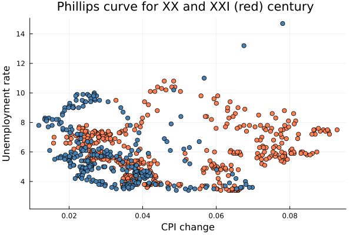

## Regime switching Phillips curve

One of the most popular macroeconomic relationships is the trade-off between inflation and unemployment. The so-called Phillips curve is discussed in both introductory macroeconomics courses and at meetings of central banks. The curve is an empirical observation that provide some evidence of a stylized fact that the inflation falls during recessions and rises during booms.

However, many policymakers and academic economists have argued that the historical relationship has changed over time. The 'flattening' of the Phillips curve poses a challenge for policymakers, as it can imply that countercyclical policy may not be effective in steering inflation toward the established central bank's target.

To investigate the time-varying nature of the Phillips curve, we estimate a Markov switching model.

First we would need a dataset with quarterly inflation and unemployment. We will use the data from the Federal Reserve Bank of St. Louis (FRED) database. The data are available in the repo of the package.

```@example phillips
using MarSwitching
using DataFrames
using CSV

df = CSV.read("my_assets/philips.csv", DataFrame)

model_df = dropmissing(select(df, [:inflation_q, :unrate, :infexp]))  
```

Let's see how the relationship looks like in the data:

```jldoctest
using Plots

plot_df = filter(x -> x.inflation_q .> -5, model_df)

phil_plot = plot(plot_df.unrate, plot_df.inflation_q,
                seriestype=:scatter, legend = :none,
                xlabel = "Unemployment rate gap", ylabel = "CPI change", title = "Phillips curve for USA")
```


Overall, the relationship is far from being clear. The slope of plotted data is just slightly negative. 

```jldoctest
x = [ones(size(model_df)[1]) model_df.unrate]
(x'x)^(-1)*(x'model_df.inflation_q)
```

However, as it often the case, plotting scatterplots falls short when trying to find evidence of more complex phenomena. 

Now, how can theory guide our model specification? The developments in New Keynesian economic theory, provides a model where: 

- Inflation is sticky, i.e. it does not adjust immediately to changes in the economy. This might be because of the contracts between firms and workers, or because of the inertia in the price setting process.

- Inflation expectations matter. The economic agents keep in mind the inflation target of the central bank or the past inflation when setting prices.

Both of the reasons above suggests the use of another variable, namely inflation moving average. Altough obvious frome purely econometric point of view, addition of this variable is well grounded in theory. 

```jldoctest
x = [ones(size(model_df)[1]) model_df.unrate model_df.infexp]
(x'x)^(-1)*(x'model_df.inflation_q)
```

Indeed, once we add the inflation expectations, the slope of the Phillips curve becomes more negative.

Now, in order to check the time-varying nature of the Phillips curve, or the so-called "flattening" of thereof. We will estimate a Markov switching model. 

```jldoctest
using Random

Random.seed!(1)
model = MSModel(model_df.inflation_q, 2, 
                exog_switching_vars = [model_df.unrate model_df.infexp],
                switching_var = true)

summary_msm(model) 
```
