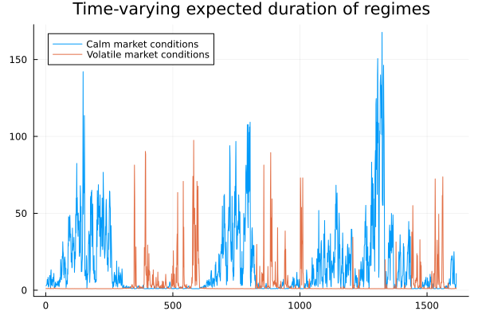

# Time-varying transition probabilites - modelling stock market

Stock market analysts often describes different periods as volatile or calm market conditions. 
Each of these states of market are characterized by different dynamics of stock prices. 
In following example we will see that the Markov Switching models are well suited to describe not only the regime characteristics but also what determines the chance of switching between them.

We will begin by loading the weekly data of S&P 500 and VIX volatility index. S&P 500 is arguable the most important stock market index consisting of approximately 500 largest companies in the US. VIX is an option implied measure of expected volatility of S&P500 index. It is often referred to as the "fear index" as it tends to increase during periods of market turmoil. The dataset already contains columns with lagged variables and rate of returns.


```jldoctest spx
using MarSwitching
using CSV
using DataFrames
using Plots
using Random
using Distributions
using StatsBase
using Statistics

df = CSV.read("my_assets/df_spx.csv", DataFrame)
```

The model we are going to estimate might be challanging for the optimizing algorithm, thus we can help it by standardizing the variables. This is especially important for the models with time-varying transition probability matrix.

```jldoctest spx
σ_spx = std(df.spx)
σ_vix = std(df.vix)
μ_spx = mean(df.spx)
μ_vix = mean(df.vix)

df.spx = (df.spx .- μ_spx) ./ σ_spx
df.vix_lag = (df.vix_lag .- μ_vix) ./ σ_vix
df.spx_lag = (df.spx_lag .- μ_spx) ./ σ_spx
```
We want to inspect how the S&P500 returns behave under different regimes and how the probability of switching between them is determined. In order not to risk falling into local maxima the we will estimate a univariate model with lags and a single exogenous variable (VIX) for TVTP parameters. Note, in order to have intercept in the TVTP parameters the user need to provide a column of singles. Unlike in the specification of regression, that is done with `intercept` argument. We will also use random search for expectation-maximization algorithm to find the best starting values that are possibly close to global maxima.

```jldoctest spx
# estimating 2-regime model with TVTP and one switching variable
Random.seed!(123)
model = MSModel(df.spx, 2,
                exog_switching_vars = df.spx_lag,    
                exog_tvtp = [ones(length(df.vix)) df.vix_lag],
                random_search_em = 20)

summary_msm(model)  
```
```jldoctest spx
Markov Switching Model with 2 regimes
=================================================================
# of observations:         1709 AIC:                      4299.094
# of estimated parameters:   10 BIC:                      4353.531
Error distribution:    Gaussian Instant. adj. R^2:          0.0058
Loglikelihood:          -2139.5 Step-ahead adj. R^2:        0.0115
-----------------------------------------------------------------
------------------------------
Summary of regime 1:
------------------------------
Coefficient  |  Estimate  |  Std. Error  |  z value  |  Pr(>|z|)
-------------------------------------------------------------------
β_0          |     0.067  |       0.021  |    3.183  |     0.001  
β_1          |     -0.07  |        0.03  |   -2.328  |      0.02  
σ            |     0.553  |       0.017  |   32.272  |    < 1e-3
-------------------------------------------------------------------
Expected regime duration: 13.12 periods
-------------------------------------------------------------------
------------------------------
Summary of regime 2:
------------------------------
Coefficient  |  Estimate  |  Std. Error  |  z value  |  Pr(>|z|)
-------------------------------------------------------------------
β_0          |    -0.115  |       0.065  |   -1.787  |     0.074  
β_1          |    -0.056  |       0.046  |   -1.232  |     0.218  
σ            |     1.483  |       0.026  |   57.781  |    < 1e-3
-------------------------------------------------------------------
Expected regime duration: 378.89 periods
-------------------------------------------------------------------
Time-varying parameters: 
===================================================================
Summary of term 1 (intercept) in TVTP equations:
-------------------------------------------------------------------
Coefficient  |  Estimate  |  Std. Error  |  z value  |  Pr(>|z|)
-------------------------------------------------------------------
δ_0 [1 -> 1] |     0.047  |        0.59  |    0.079  |     0.937
δ_0 [2 -> 1] |     1.436  |       0.681  |     2.11  |     0.035
-------------------------------------------------------------------
Summary of term 2 (slope) in TVTP equations:
-------------------------------------------------------------------
Coefficient  |  Estimate  |  Std. Error  |  z value  |  Pr(>|z|)
-------------------------------------------------------------------
δ_1 [1 -> 1] |    -3.923  |        0.84  |   -4.669  |    < 1e-3
δ_1 [2 -> 1] |     -3.65  |        1.22  |   -2.992  |     0.003
-------------------------------------------------------------------
```

The estimated model has a following form:

```math
\Delta \text{S\&P500}_t = 
\begin{cases}
    0.067 - 0.07 \times \Delta \text{S\&P500}_{t-1} + \epsilon_{1,t} ,& \epsilon_1 &\sim \mathbb{N}(0,0.553), & \text{for } S_t = 1\\
    -0.115 - 0.056 \times \Delta \text{S\&P500}_{t-1} + \epsilon_{2,t} ,& \epsilon_2 &\sim \mathbb{N}(0,1.483), & \text{for } S_t = 2
\end{cases}
```

With the following time-varying transition probability matrix:

```math
P(S_t = 1 | S_{t-1} = 1)_t = \dfrac{exp(0.047 - 3.923 \times \text{VIX}_{t-1})}{\textstyle exp(0.047 - 3.923 \times \text{VIX}_{t-1}) + 1}
```
```math
P(S_t = 2 | S_{t-1} = 1)_t = \dfrac{exp(1.436 - 3.65 \times \text{VIX}_{t-1})}{\textstyle exp(1.436 - 3.65 \times \text{VIX}_{t-1}) + 1}
```

The estimated model distinguish two market regimes. The first one may be described as calm market conditions with low volatility and a positive drift, or in other words, a bull market. This regime reacts negatively but with a small effect to the lagged returns of the index (here denoted as delta, with a slight abuse of standard notation). 

The second regime is characterized by a negative drift and a much higher volatility. This regime is often referred to as a bear market. The price dynamics in this regime behave more like random walk with a negative drift, as the lagged variable have no significant effect on the current price change.

What can the TVTP parameter tell us? Since the model uses logit function in order to model probabilites in a reasonable way, it is complicated to interpret them in a natural way (as is the case for logistic regression). However, we can see that the chance of switching from the second regime to the first one is significantly decreasing with the VIX index, thus the VIX is triggering the bear market. The same in the opposite direction.

We can now inspect the smoothed probabilites of each regime:

```jldoctest spx
plot(smoothed_probs(model)[end-300:end,:],
                    label     = ["Calm market conditions" "Volatile market conditions"],
                    title     = "Regime probabilities", 
                    linewidth = 2,
                    legend = :bottomleft)
```


We can see by the last 300 weeks, that the regimes are switching quite frequently. However, there are also around 20-30 week-long periods of a single dominant regime. What might look promising for an investor (and less so for trader) is that the calm market conditions are more frequent than the volatile ones.

```jldoctest spx
plot(expected_duration(model)[expected_duration(model)[:,2] .< 100,:],
        label = ["Calm market conditions" "Volatile market conditions"],
        title = "Time-varying expected duration of regimes") 
```


Since the transition matrix is time-varying, its expected duration is as well. Similarily, the plot shows that predominantly, markets are expected to stay in the calm regime.

Having already found a decent model for the data generating process of the stock market returns, we can also use it for risk management. Function `generate_msm` thanks to Julia's multi-threading, is able to work either with provided parameters of Markov Switching model or from already estimated one. We will use this function for Monte carlo simulation that will allow us to calculate 1% Value-at-Risk (VaR) of S&P500 index. 

```jldoctest spx
println("model VaR: ", round(quantile((generate_msm(model, 5000)[1] .+ μ_spx ) .* σ_spx, 0.01), digits=4))
println("empirical VaR: ", round(quantile((df.spx .+ μ_spx) .* σ_spx, 0.01), digits=4))
println("Distribution VaR: ", round(quantile(Normal(μ_spx, σ_spx), 0.01), digits=4))
```
```jldoctest spx
model VaR: -0.0773
empirical VaR: -0.0735
Distribution VaR: -0.0503
```
Altough the model was not explicitly specified to explain the tail distribution, it manages to capture it quite well. The VaR calculated from the model is closer to the empirical one than the VaR calculated from the normal distribution (which to be fair is not the best distribution in finance but nonetheless is used commonly).


